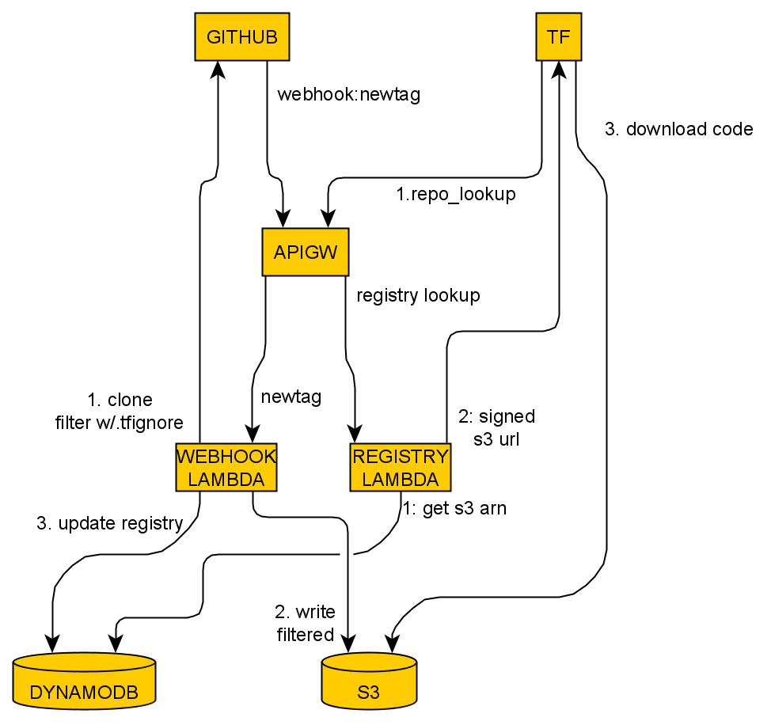

# How it works

This document gives a short description of the moving parts in the project.

## Components

The project consists of the following actors and AWS resources:

* GitHub: this is where the original source code for the hosted Terraform modules is stored
* Terraform Files (TF): These are Terraform modules that referenced hosted modules. They might be hosted themselves.
* API Gateway (APIGW): The Gateway exposes REST interfaces to GitHub, Terraform, and developers backed by lambdas.
  * Webhook Lambda: Receives GitHub webhooks about releases, pulls the code to S3, and updates the registry in DynamoDB
  * Registry Lambda: Receives lookups from Terraform during initialization, and returns version and location information about hosted modules
* DynamoDB: A registry of hosted modules with version and location info
* S3: The actual repository, where filtered and zipped and modules are stored

## Workflow

The registry has two use cases: store a new release, and return module versions, each backed by a Lambda function.

### Store a new release

To store releases in the registry, the developer creates a webhook that fires either on new tags, new releases, or both. The webhook should target the Webhook lambda API gateway endpoint, using a shared secret for authentication.

When the Webhook lambda is triggered, it checks out the new code from GitHub, authenticating with a personal access token. It then scans the code for ".tfignore" files. These work similarly to ".gitignore", in that they can be stored anywhere in the code tree, and affect everything in the folder or deeper.

All files that match the ignore list are deleted. Additionally, all ".git*" files- and directories is removed. Finally the ".tfignore" files are removed. The resulting tree is zipped and uploaded to S3. 

After uploading the code, the Lambda writes the new version a registry in DynamoDB. 

Finally, after updating the registry, the Lambda shuts down and discards its temporary checkout of the code.

### Return module versions

The API Gateway exposes a number of endpoints that act as a [Terraform private registry](https://www.terraform.io/docs/registry/private.html), exposing a subset of the [registry API](https://www.terraform.io/docs/registry/api.html). As such, the registry can be queried by Terraform modules using the normal syntax:

```terraform
module "sg" {
    source = "registry.io/swissarmyronin/example/aws"
    version = "~> 1.0"
}
```

In the example above, Terraform would expect to get a download URL for the newest version of the module beginning win 1.x but semantically lower than 2.x.

The query happens when `terraform init` tries to resolve the module definition. API Gateway hands the query off to the Registry Lambda, which queries DynamoDB for any matching versions and returns a signed S3 URL that is good for 4 hours, if a version is found.

Terraform then downloads the module from the URL, and caches it locally in `.terraform/modules`.
